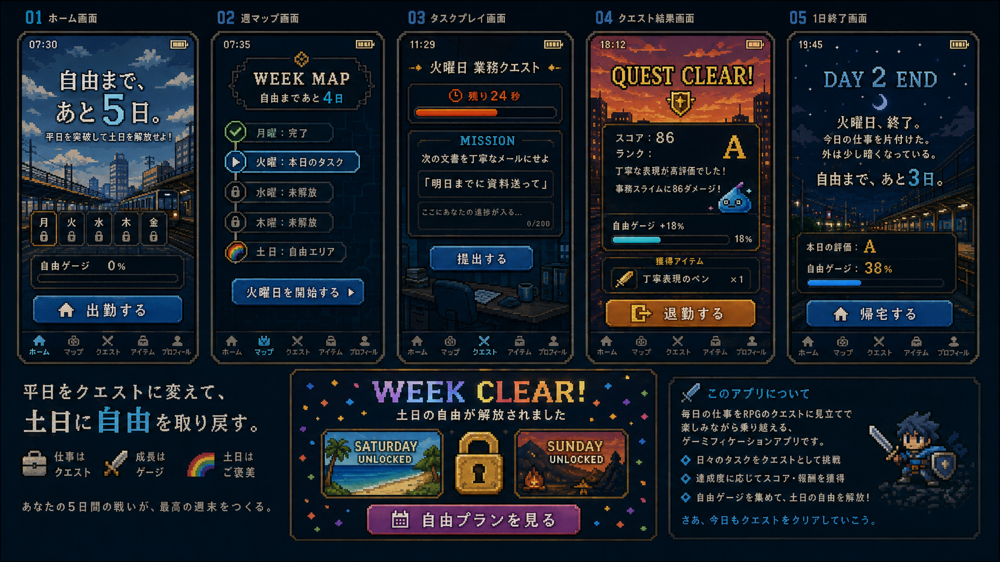

# 自由まで、あと5日。（FreeWeeK）

平日5日分の仕事風ミニゲームをAIが出題・採点し、5日間を突破すると土日の自由が解放されるWebゲームです。



## 遊び方

1. **出勤する** — AIが月曜〜金曜の5日分の業務クエストを生成します
2. 毎日1つ、**30秒タスク**（メール丁寧化・事務計算・敬語変換・要約・優先順位判断）に挑戦します
3. AI上司が回答を採点し、RPG風のフィードバックと自由ゲージを返します
4. 5日間を突破すると**土日が解放**され、AIがあなた専用の自由な土日プランを生成します

## 技術構成

| 項目 | 使用技術 |
| --- | --- |
| フロントエンド | Next.js (App Router) / React |
| デザイン | Tailwind CSS |
| AI API | ChatGPT API（未設定時はローカル問題バンク・ローカル採点にフォールバック） |
| テスト | Vitest |
| デプロイ | Vercel |

## セットアップ

```bash
npm install
npm run dev
```

http://localhost:3000 を開いてください。

### 環境変数（任意）

`OPENAI_API_KEY` を設定すると、タスク生成・採点・エンディング生成にChatGPT APIを使用します。未設定でもローカルフォールバックで全機能が動作します。

```env
OPENAI_API_KEY=sk-xxxxxxxx
OPENAI_MODEL=gpt-4o-mini
```

## テスト

```bash
npx vitest run
```

## ディレクトリ構成

```text
src/
  app/
    page.tsx              # ゲーム本体（状態マシン）
    api/
      generate-tasks/     # 5日分タスク生成
      score-answer/       # 回答採点（計算・選択はローカル、文章はAI）
      generate-ending/    # 土日エンディング生成
  components/             # FreedomGauge / TimerBar / WeekMap
  features/
    games/                # ゲーム定義・ローカル問題バンク
    ai/                   # OpenAIクライアント・プロンプト
    game-engine/          # 採点・進行ロジック（テスト付き）
  types/                  # 型定義
docs/                     # 要件定義・UI設計・デザインモック
```

## ゲームの追加方法

1. `src/features/games/definitions.ts` に `GameDefinition` を追加
2. `src/features/games/taskBank.ts` にローカル問題を追加
3. 必要に応じて `src/features/ai/prompts.ts` と `src/features/game-engine/scoring.ts` を調整
